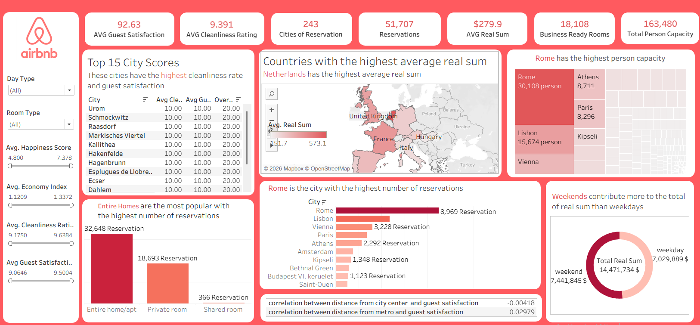
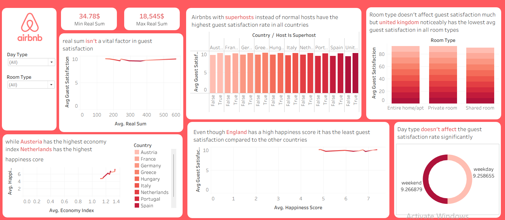
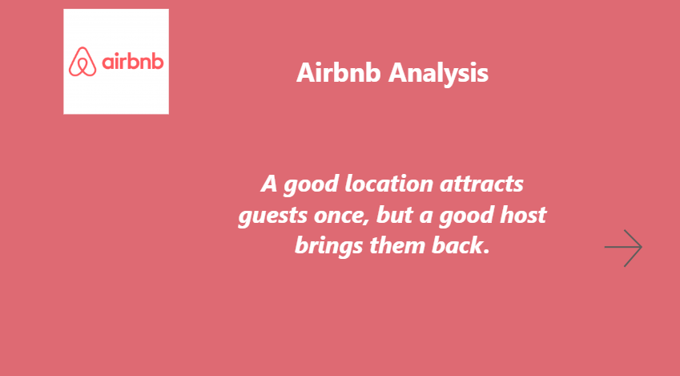
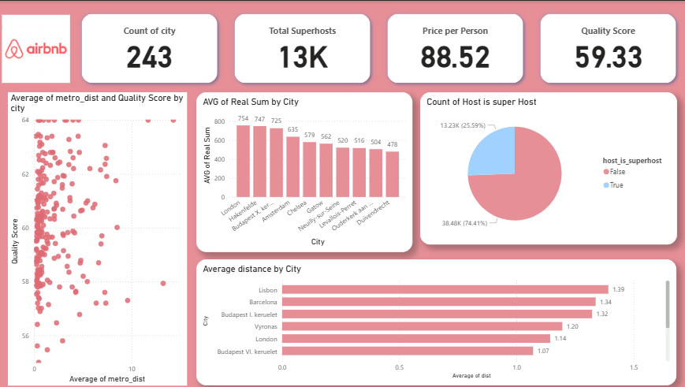
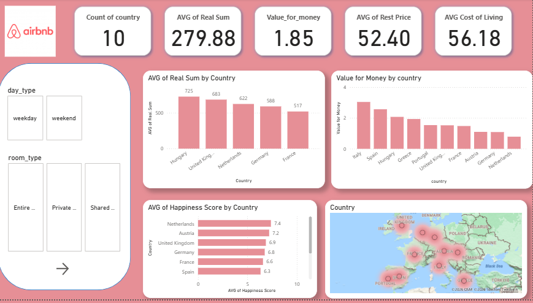
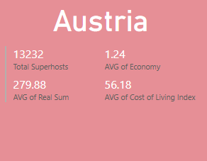
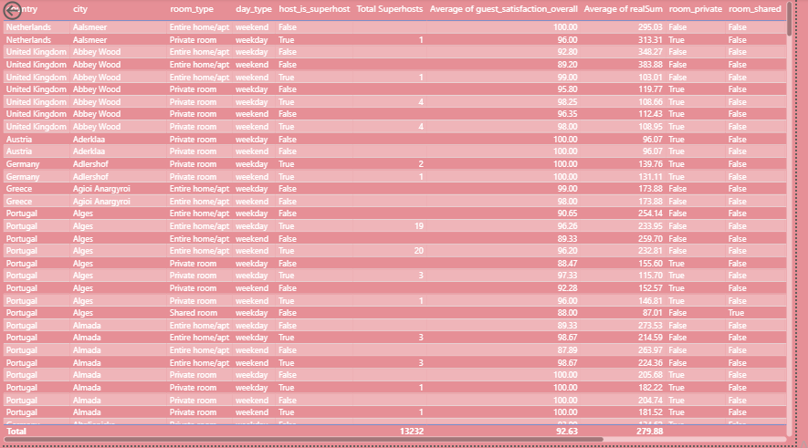

# ODC Instant Data Analysis Hackathon — Airbnb Prices in European Cities

Project for ODC / Instant Data Analysis Hackathon — NaghamProgrammer and team

## Overview
This repository contains the work our team completed during the hackathon. We combined and enriched an Airbnb dataset for European cities, cleaned and filled missing values using web scraping, organized the cleaned data in a normalized database, created interactive dashboards, and built prediction models to recommend cities for listings.

High-level deliverables:
- Data consolidation and feature enrichment (final_df2.csv)
- Data cleaning and null-filling via web scraping
- Database schema, DDL, and bulk loading (Database/)
- Dashboards (Tableau + Powerbi)
- Prediction notebooks using LightGBM and a neural network (predictor.ipynb)
- Correlation and exploratory visualizations (images/)

## Repo structure
- `final_df2.csv` — Final cleaned and enriched CSV (output of Day 1)
- `Copy_of_ODC_&_Instant_Data_analysis_Hackathon.ipynb` — Day 1 exploratory notebook and preprocessing
- `predictor.ipynb` — Prediction notebook (LGBMRegressor + neural network)
- `Database/` — SQL DDL, ERD, bulk import scripts, and SQL queries (Day 2)
- `images/` — Visualizations, correlation matrices, and dashboard screenshots

## Day-by-day summary

### Day 1 — Data consolidation, enrichment, and cleaning
Goal: Combine all files from the Kaggle dataset and enrich the dataset with external features and geolocation improvements.

What we did:
- Combined all files from the Kaggle dataset: [Airbnb prices in European cities (Kaggle)](https://www.kaggle.com/datasets/thedevastator/airbnb-prices-in-european-cities) into a single file.
- Improved location accuracy using `reverse_geocoder` with the existing longitude and latitude, and standardized country codes using `pycountry`.
- Added external country-level features:
  - Cost of Living indicators from "myrios/cost-of-living-index-by-country-by-number-2024"
    - `Cost of Living Index`, `Groceries Index`, `Restaurant Price Index`
  - Happiness & economy metrics from "unsdsn/world-happiness"
    - `happiness score`, `Economy (GDP per capita)`
- Filled null/missing values using web scraping with BeautifulSoup from the World Happiness Report pages:
  - [World Happiness Report (Wikipedia)](https://en.wikipedia.org/wiki/World_Happiness_Report)
- Final combined and cleaned output: `final_df2.csv`
- Exploratory visualizations and two correlation matrices are shown below.

Correlation with guest satisfaction:

Effect of boolean features on numeric features:

See `Copy_of_ODC_&_Instant_Data_analysis_Hackathon.ipynb` for step-by-step preprocessing, enrichment, and cleaning code.

### Day 2 — Database design and analytics (normalization + SQL)
Goal: Organize the enriched dataset into a normalized relational schema and run analytical SQL.

What we did:
- Designed an unnormalized ERD to analyze redundancy and normalization benefits.
- Created a normalized database schema (DDL) and implemented tables with appropriate constraints (primary keys, foreign keys, unique constraints, not-null where applicable).
- Performed bulk insertion of `final_df2.csv` into the database to handle large size and mixed data types reliably.
- Implemented joins to integrate datasets, and wrote the requested analytical SQL queries:
  - Created tables with constraints
  - Integrated datasets using correct joins
  - Wrote analytical SQL queries to answer business questions
  - Created at least one VIEW
  - Used Common Table Expressions (CTEs)
  - Used window functions for advanced analysis where applicable
- All database-related files, DDL, ERD diagrams, and SQL query scripts are in the `Database/` directory.

### Day 3 — Dashboards and prediction
Goal: Visualize insights and build prediction models.

Tableau dashboards (screenshots):

Other dashboard screenshots:

Prediction:
- `predictor.ipynb` contains two modeling approaches:
  1. Regression using `LGBMRegressor` to predict "real sum" (price).
  2. Neural network (with Adam optimizer) that uses `real sum`, `number of bedrooms`, and `person capacity` to produce top-5 cities where an Airbnb with those specs exists (recommender-style output).

## Key files to inspect
- `final_df2.csv` — final cleaned dataset (Day 1 output)
- `Copy_of_ODC_&_Instant_Data_analysis_Hackathon.ipynb` — main processing & EDA notebook
- `predictor.ipynb` — modeling and recommender
- `Database/` — schema, DDL, bulk import, SQL queries
- `images/` — all visualization screenshots (displayed above)

## Data sources & credits
- Original Airbnb dataset: [Airbnb prices in European cities (Kaggle)](https://www.kaggle.com/datasets/thedevastator/airbnb-prices-in-european-cities)
- Cost of living indicators: "myrios/cost-of-living-index-by-country-by-number-2024"
- World happiness metrics: "unsdsn/world-happiness"
- World Happiness Report pages used for scraping: [World Happiness Report (Wikipedia)](https://en.wikipedia.org/wiki/World_Happiness_Report)

Please ensure you comply with the terms of use for each data source when sharing or publishing results.

## Findings & notes (short)
- Added country-level economic and quality-of-life features that provide additional predictive power for price and guest satisfaction analyses.
- Correlation matrices (see images/) show relationships between price and guest satisfaction and the influence of boolean features on numeric features.
- The recommender model (neural network) can list top 5 candidate cities for a given price, bedrooms, and capacity.

